# 把 app-install.py 整合进 dra 的详细计划
## 核心结论与整体架构
dra 现有的 `--install` 功能针对 tar.gz 只做"解压 + 拷贝可执行文件到目标目录"，并不会生成 `.desktop`、`.service`、软链接和卸载脚本。而 app-install.py 做的是一整套"便携应用安装到 `~/.local/app/<name>`"的流程：推导应用名 → 解压(剥离顶层目录) → 生成 desktop/service → 建软链接 → 写 uninstall.sh。所以整合的本质是：**在 dra 的 download 流程之后，新增一条"便携应用安装(PortableAppInstall)"分支**，把 Python 脚本的五个阶段用 Rust 原生重写，并通过 CLI 参数 + recipe 清单文件补齐脚本里 `--pkg/--bin/--icon` 这种无法自动推断的元信息。
整体数据流如下：

```mermaid
flowchart LR
    A["dra download/install-app<br/>owner/repo [--bin bin/code] [--icon ...]"] --> B["GitHub API 取最新 release asset"]
    B --> C{选择 asset}
    C -->|automatic / select / interactive| D["ureq 下载到 temp_file"]
    D --> E["复用现有 tar_archive_installer<br/>解压到 temp_dir"]
    E --> F["PortableAppInstaller<br/>(新增模块)"]
    F --> G["路径准备 ~/.local/app/name"]
    G --> H["剥离顶层目录拷贝到 app_dir"]
    H --> I["生成 .desktop / .service / 软链接 / uninstall.sh"]
    I --> J["可选: systemctl --user daemon-reload"]
    J --> K["输出安装结果 + uninstall 提示"]
```

---
## 一、两个项目的现状梳理
### dra 现有结构与可复用点
dra 的源码目录 `src/` 下已划分为 `cli/`、`github/`、`installer/`、`system/` 等模块。其中 `installer/` 已经有一套成熟的归档安装器：
- `tar_archive_installer.rs` 用 `flate2 + tar` 解 `.tar.gz`，`xz2` 解 `.tar.xz`，`bzip2` 解 `.tar.bz2`
- `archive_installer.rs` 负责在 temp 目录解压后用 `walkdir` 扫描可执行文件并拷贝到 `Destination`
- `install.rs` 是入口分发，按 `FileType` 路由到对应安装器
- CLI 在 `root_command.rs` 用 clap derive 定义 `Download` 子命令，含 `--install/-i`、`--install-file/-I`、`--select/-s`、`--automatic/-a`、`--output/-o`、`--tag/-t`
- `Cargo.toml` 已带 `flate2`、`tar`、`xz2`、`bzip2`、`walkdir`、`indicatif`、`dialoguer`、`ureq`、`clap`，**这些依赖可直接复用，无需新增大依赖**
可复用资产：下载链路（github 模块 + ureq）、temp 目录管理（`temp_file.rs`）、tar.gz 解压逻辑（`TarArchiveInstaller::extract_gz`）、进度条/spinner、CLI 框架。
### app-install.py 的逻辑五阶段
| 阶段 | Python 实现 | 关键行为 |
|---|---|---|
| ① 路径常量 | `HOME/.local/app`、`~/.local/bin`、`~/.local/share/applications`、`~/.config/systemd/user`、`~/.config/autostart` | 全部用户级，无需 sudo |
| ② CLI 解析 | `--pkg/--bin/--icon/--cicon/--name/--service/--autostart` | `--bin` 是包内可执行文件相对路径，必须用户提供 |
| ③ 解压 | `tarfile` + `get_common_prefix` 剥离顶层共用目录 | 与 dra 的 `tar.unpack` 行为不同：dra 不剥离顶层 |
| ④ 激活 | 生成 `.desktop`、`.service`、`~/.local/bin/<name>` 软链接、autostart 软链接、`uninstall.sh` | desktop 里 `Exec/Path/Icon` 用绝对路径 |
| ⑤ 主流程 | 名称推导(`-` 分隔首段) → 覆盖确认 → 解压 → desktop/service → 软链接 → enable service → 写 uninstall | `systemctl` 失败非致命 |
---
## 二、整合策略：新增子命令而非塞进 `--install`
**推荐方案：新增 `dra install-app` 子命令**（或 `dra download --install-app` 长选项），与现有 `--install` 并存。原因：
1. 现有 `--install` 的语义是"安装可执行文件到 PATH/目标目录"，已被 deb/rpm/tar/zip 等多种格式共用，强行塞入 `~/.local/app` 语义会破坏向后兼容。
2. app-install.py 需要 `--bin` 这种"包内相对路径"参数，而 dra 现有 `--install-file` 是"可执行文件名"而非路径，语义不一致。
3. 子命令方式更易扩展 recipe 清单、卸载、列出已装应用等后续功能。
### CLI 参数设计
```bash
# 下载并作为便携应用安装（一条命令完成）
dra install-app owner/repo \
  --bin bin/code \
  --name vscode \
  --icon share/icons/code.png \
  --service \
  --autostart
# 只安装本地已下载的 tar.gz（保留脚本原有用法）
dra install-app --pkg ./code.tar.gz --bin bin/code --name vscode
# recipe 模式：从清单文件读取元信息，避免每次敲长参数
dra install-app owner/repo --recipe ~/.config/dra/recipes/vscode.toml
# 卸载
dra uninstall-app vscode
```
与现有参数的对应关系：
| app-install.py 参数 | dra 新参数 | 默认值 | 说明 |
|---|---|---|---|
| `--pkg` | (位置参数 repo) 或 `--pkg <path>` | — | 有 repo 走下载，有 `--pkg` 走本地文件 |
| `--bin` | `--bin <rel-path>` | **必填** | 包内可执行文件相对路径，无法自动推断 |
| `--icon` | `--icon <rel-path>` | None | 包内图标相对路径 |
| `--cicon` | `--cicon <path>` | None | 外部图标文件路径 |
| `--name` | `--name <name>` | 从 asset 文件名 `-` 前推导 | 应用名 |
| `--service` | `--service` flag | false | 生成 systemd user service |
| `--autostart` | `--autostart` flag | false | autostart 软链接 |
| (无) | `--recipe <path>` | None | TOML 清单，一次配置反复用 |
| (无) | `--output` | `~/.local/app/<name>` | 安装根目录，允许自定义 |
| (无) | `--yes/-y` | false | 跳过覆盖确认 |
---
## 三、Rust 模块划分
在 `src/installer/` 下新增 `portable_app/` 子模块，与现有归档安装器并列：
```
src/installer/
├── install.rs                 # 路由入口，保持不变
├── tar_archive_installer.rs   # 保持不变
├── archive_installer.rs       # 保持不变
└── portable_app/              # 新增
    ├── mod.rs                 # PortableAppInstaller 主结构 + run()
    ├── paths.rs               # 路径常量(对应 Python 的 HOME/.local/app 等)
    ├── name.rs                # derive_name() 名称推导
    ├── extract.rs             # 解压 + 剥离顶层目录逻辑
    ├── desktop.rs             # 生成 .desktop
    ├── service.rs             # 生成 .service + systemctl 调用
    ├── symlink.rs             # 创建软链接 + 冲突处理
    └── uninstall.rs           # 生成 uninstall.sh + 卸载命令实现
```
同时：
- `src/cli/root_command.rs`：在 `Command` 枚举里新增 `InstallApp { ... }` 和 `UninstallApp { name, ... }` 两个变体
- `src/cli/install_app_handler.rs`：新增 handler，编排"下载 → 解压 → 便携安装"
- `Cargo.toml`：无需新增大依赖；`toml` crate 用于 recipe 解析（可选，或用已有的简单解析）
---
## 四、分阶段任务清单
### 阶段 0：准备
- [ ] fork 已有 `AlexIllinois2/dra` 分支，建 `feature/portable-app-install` 分支
- [ ] 跑通 `make release` 确认现有测试不破
- [ ] 把 `app-install.py` 的几个真实用例（如 VSCode tar.gz）固化为集成测试夹具
### 阶段 1：移植核心逻辑（不接下载，先支持 `--pkg`）
| 任务 | 对应 Python 函数 | Rust 实现要点 |
|---|---|---|
| 路径常量 | 模块顶部常量 | `dirs::home_dir()` 或直接 `std::env::var("HOME")`；dra 已有 `system` 模块可放 |
| 名称推导 | `derive_name` | `Path::file_name` → 按 `-` split first |
| 解压+剥离顶层 | `get_common_prefix` + `extract_package` | 用 `tar::Archive` 遍历 entries，计算共同前缀，重写 `entry.path()` 后 `unpack` 到 app_dir |
| 生成 desktop | `generate_desktop` | `std::fs::write` + `PermissionsExt::set_mode(0o755)` |
| 生成 service | `generate_service` | 同上，mode 0o644 |
| 创建软链接 | `create_symlink` | `std::os::unix::fs::symlink`；冲突时按 resolve 比较 |
| enable service | `enable_service` | `std::process::Command::new("systemctl")`，捕获 stderr，失败转 warn |
| 写 uninstall.sh | `write_uninstall_script` | 字符串拼接 `write_text` + chmod 0o755 |
**剥离顶层目录**是 Python 脚本与 dra 现有 `tar.unpack` 的关键差异点，必须单独实现，否则 VSCode 这种 `tar.gz` 解压后会出现 `app_dir/VSCode-linux-x64/bin/code` 而非 `app_dir/bin/code`。
### 阶段 2：接入 dra 下载链路
- [ ] 在 `install_app_handler.rs` 里复用 `github` 模块拿 release asset 列表
- [ ] 复用 `download_handler` 的 selection/automatic/interactive 三种模式选 asset
- [ ] 用 `ureq` + `indicatif` 下载到 `temp_file::make_temp_dir()`（与 `ArchiveInstaller::create_temp_dir` 一致）
- [ ] 下载完成后调用阶段 1 的 `PortableAppInstaller::run(pkg_path, config)`
- [ ] 安装成功后清理 temp 文件
### 阶段 3：CLI 接入
- [ ] `root_command.rs` 新增 `InstallApp` / `UninstallApp` 变体及全部参数
- [ ] `main.rs` 路由到新 handler
- [ ] 补 `clap_complete` 的 shell 补全（dra 已有 completion 子命令）
- [ ] 在 README/CHANGELOG 里加用法示例
### 阶段 4：测试与边界
- [ ] 单测：`derive_name`、`get_common_prefix`、desktop/service 模板字符串
- [ ] 集成测试：用 `devmatteini/dra-tests` 仓库的 helloworld tar.gz 跑通整条链路
- [ ] 边界：覆盖已存在目录(`--yes`)、软链接冲突、`systemctl` 不存在、`--bin` 路径在包内不存在、非 tar.gz asset 报错提示
- [ ] 跨平台：Windows 下软链接需特权，建议此功能 `#[cfg(target_family = "unix")]` 守卫，Windows 上给出明确不支持提示
---
## 五、关键代码改造点示例
**新增 handler 编排下载→安装**（伪代码）：
```rust
// src/cli/install_app_handler.rs
pub fn handle_install_app(cli: InstallAppArgs) -> Result<()> {
    let pkg_path = if let Some(pkg) = &cli.pkg {
        pkg.clone()                              // 本地模式
    } else {
        let repo = cli.repo.as_ref().ok_or(...)?;
        let asset = select_asset(repo, &cli)?;   // 复用现有 selection 逻辑
        download_asset(repo, &asset, &temp_dir)? // 复用 ureq + indicatif
    };
    let config = PortableAppConfig::from_cli(&cli)?;
    let result = PortableAppInstaller::run(&pkg_path, config)?;
    println!("{}", result.summary());            // 含 uninstall 提示
    Ok(())
}
```
**复用现有 tar 解压但加剥离逻辑**：
```rust
// src/installer/portable_app/extract.rs
pub fn extract_strip_prefix(pkg: &Path, target: &Path) -> Result<()> {
    let f = File::open(pkg)?;
    let dec = GzDecoder::new(f);
    let mut arch = tar::Archive::new(dec);
    let prefix = common_top_level(&arch)?;       // 对应 get_common_prefix
    for entry in arch.entries()? {
        let mut e = entry?;
        let p = e.path()?.into_owned();
        let rel = strip_prefix(&p, prefix.as_deref())?;
        e.path(rel);                             // 重写 entry path
        e.unpack_in(target)?;
    }
    Ok(())
}
```
`common_top_level` 直接复用 `tar::Archive::entries()` 遍历，比 Python 版少一次 `getmembers()` 全量加载。
**systemd 调用**用 `std::process::Command`，与 Python 的 `subprocess.run(..., capture_output=True)` 等价，失败时降级为 warn 不中断：
```rust
fn enable_service(app_name: &str) {
    for args in [["--user","daemon-reload"], ["--user","enable", &format!("{app_name}.service")]] {
        if let Err(e) = Command::new("systemctl").args(args).output() {
            log_warn(&format!("systemctl failed (non-fatal): {e}"));
            return;
        }
    }
}
```
---
## 六、潜在问题与对策
| 风险点 | 说明 | 对策 |
|---|---|---|
| `--bin` 无法自动推断 | 不同 portable app 的可执行文件路径各异（VSCode 是 `bin/code`， others 是 `app/run.sh`） | 强制 `--bin` 或 `--recipe`；未来可加常见 app 的内置 recipe 表 |
| 剥离顶层目录与 dra 现有 `tar.unpack` 行为冲突 | dra 现有归档安装器不剥离顶层 | 新模块独立实现 `extract_strip_prefix`，不动现有 `TarArchiveInstaller` |
| `~/.local/bin` 不在 PATH | 安装后软链接建好但用户 `command -v` 找不到 | 安装结束时检测并提示 `export PATH=$HOME/.local/bin:$PATH` |
| Windows / macOS 兼容 | `.desktop`、systemd user service 是 Linux 概念 | `#[cfg(target_os = "linux")]` 守卫；macOS 可后续生成 `.app` bundle，Windows 生成 Start Menu 快捷方式，作为后续 issue |
| 覆盖安装 | app_dir 已存在时 Python 用 `input()` 交互 | 复用 dra 已有的 `dialoguer` 依赖做确认弹窗，或 `--yes` 跳过 |
| 下载失败/解压失败残留 | temp 目录或半成品 app_dir 残留 | 用 `scopeguard` / RAII 在错误路径上 `remove_dir_all`，与 Python 的 `shutil.rmtree(app_dir, ignore_errors=True)` 一致 |
| recipe 文件格式 | 长命令难记 | TOML 清单：`name=`, `bin=`, `icon=`, `service=`, `autostart=`, `repo=`, `tag=`, `select=` |
---
## 七、验收标准
1. `dra install-app microsoft/vscode --select '*x64.tar.gz' --bin bin/code --name vscode` 一条命令完成下载 + 安装到 `~/.local/app/vscode`，`~/.local/bin/vscode` 软链接可用，应用菜单出现 VSCode 图标。
2. `dra uninstall-app vscode` 干净卸载（停服务、删软链接、删 app_dir）。
3. `dra install-app --pkg ./local.tar.gz --bin bin/code` 保留纯本地安装能力，行为与原 `app-install.py` 完全一致。
4. 现有 `dra download --install` 行为零回归（现有集成测试全绿）。
5. Linux CI 通过；Windows/macOS 上 `install-app` 给出明确"仅支持 Linux"提示而非崩溃。
完成上述四阶段后，dra 就从"只能下载"升级为"下载 + 便携应用一键安装"，且与原 Python 脚本功能对齐、与 dra 现有 install 语义解耦、可维护性远优于"shell 调用 Python"的拼接方案。
