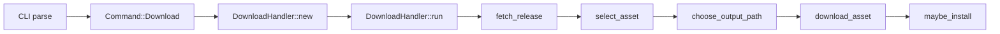

下面是一个基于你当前分支代码（`v` 分支）的**详细、可行的修改计划**，目标是在 `dra download` 子命令里增加一个可选参数 `--preview`：  
- 有 `--preview` 时：不真正下载，只打印**最终下载 URL** 和**本地文件完整路径**；  
- 没有 `--preview` 时：行为和现在完全一致。
下面所有代码位置和字段名都来自当前 `v` 分支的实际源码。
---
## 一、整体思路（先看数据流）
核心数据流大致是这样：

我们需要：
1. 在 `Command::Download` 中增加一个 `preview: bool` 字段（`--preview` 参数）。
2. 在 `DownloadHandler` 中增加字段 `preview: bool`。
3. 在 `DownloadHandler::run` 里，在真正执行下载和安装前，判断 `self.preview`：
   - 如果 `true`：打印 URL + 本地路径，然后直接返回；
   - 如果 `false`：保持原有逻辑不变。
---
## 二、修改步骤详细拆解
### 步骤 1：在 CLI 定义中添加 `--preview` 参数
文件：`src/cli/root_command.rs`
找到 `Command::Download` 的定义（你当前代码大致在 15–22 行）：
```rust
pub enum Command {
    /// Select and download an asset
    Download {
        /// GitHub repository ...
        #[arg(value_parser = Repository::try_parse)]
        repo: Repository,
        /// Select and download the first asset that matches a given pattern.
        #[arg(short, long, group = "non-interactive", value_name = "PATTERN", verbatim_doc_comment)]
        select: Option<String>,
        /// Automatically select and download an asset based on your operating system and architecture
        #[arg(short, long, group = "non-interactive")]
        automatic: bool,
        /// Set the tag name for fetching a specific release.
        #[arg(short, long, verbatim_doc_comment)]
        tag: Option<String>,
        /// Save asset to custom path (file or directory).
        #[arg(short, long, value_hint = ValueHint::AnyPath, verbatim_doc_comment)]
        output: Option<PathBuf>,
        /// Install downloaded asset
        #[arg(short, long, group = "install-feature", verbatim_doc_comment)]
        install: bool,
        /// Install downloaded asset and select which executable to install from a tar/zip archive.
        #[arg(short = 'I', long, num_args = 1, group = "install-feature", verbatim_doc_comment)]
        install_file: Option<Vec<String>>,
        /// Download asset URL prefix ...
        #[arg(long, value_name = "URL", env = "DRA_ASSET_PREFIX", verbatim_doc_comment)]
        asset_prefix: Option<String>,
        /// Download asset prefix mode: prepend | replace-host (default: prepend).
        #[arg(long, value_name = "MODE", env = "DRA_ASSET_PREFIX_MODE", default_value = "prepend", verbatim_doc_comment)]
        asset_prefix_mode: Option<String>,
        /// API request URL prefix ...
        #[arg(long, value_name = "URL", env = "DRA_API_PREFIX", verbatim_doc_comment)]
        api_prefix: Option<String>,
        /// API request prefix mode: prepend | replace-host (default: prepend).
        #[arg(long, value_name = "MODE", env = "DRA_API_PREFIX_MODE", default_value = "prepend", verbatim_doc_comment)]
        api_prefix_mode: Option<String>,
    },
    ...
}
```
在 `api_prefix_mode` 字段之后、`},` 之前新增一个字段：
```rust
        /// API request prefix mode: prepend | replace-host (default: prepend).
        #[arg(long, value_name = "MODE", env = "DRA_API_PREFIX_MODE", default_value = "prepend", verbatim_doc_comment)]
        api_prefix_mode: Option<String>,
        /// Only print what would be downloaded, without actually downloading.
        #[arg(long, verbatim_doc_comment)]
        preview: bool,
    },
```
要点：
- `#[arg(long)]`：表示长选项 `--preview`，没有短选项（如果你想要 `-p`，可以改成 `#[arg(short, long)]`）。
- 类型为 `bool`：不跟值，只作为 flag。
- 文档注释会自动变成 `--help` 输出。
---
### 步骤 2：在 `DownloadHandler` 结构体中增加 `preview` 字段
文件：`src/cli/download_handler.rs`
当前结构体定义（约 16 行）：
```rust
pub struct DownloadHandler {
    repository: Repository,
    mode: DownloadMode,
    tag: Option<Tag>,
    output: Option<PathBuf>,
    install: Install,
    proxy: ProxyConfig,
}
```
改为：
```rust
pub struct DownloadHandler {
    repository: Repository,
    mode: DownloadMode,
    tag: Option<Tag>,
    output: Option<PathBuf>,
    install: Install,
    proxy: ProxyConfig,
    preview: bool,
}
```
---
### 步骤 3：修改 `DownloadHandler::new` 以接收并保存 `preview` 参数
当前 `new` 签名（约 18–19 行）：
```rust
impl DownloadHandler {
    pub fn new(
        repository: Repository,
        select: Option<String>,
        automatic: bool,
        tag: Option<String>,
        output: Option<PathBuf>,
        install: bool,
        install_file: Option<Vec<String>>,
        asset_prefix: Option<String>,
        asset_prefix_mode: Option<String>,
        api_prefix: Option<String>,
        api_prefix_mode: Option<String>,
    ) -> Self {
        let install = Install::new(install, install_file, &repository);
        DownloadHandler {
            repository,
            mode: DownloadMode::new(select, automatic),
            tag: tag.map(Tag),
            output,
            install,
            proxy: proxy_from_cli_args(asset_prefix, asset_prefix_mode, api_prefix, api_prefix_mode),
        }
    }
```
你需要：
1. 在参数列表最后加一个 `preview: bool`：
   ```rust
       pub fn new(
           repository: Repository,
           select: Option<String>,
           automatic: bool,
           tag: Option<String>,
           output: Option<PathBuf>,
           install: bool,
           install_file: Option<Vec<String>>,
           asset_prefix: Option<String>,
           asset_prefix_mode: Option<String>,
           api_prefix: Option<String>,
           api_prefix_mode: Option<String>,
           preview: bool,    // 新增
       ) -> Self {
   ```
2. 在构造 `DownloadHandler` 时初始化这个字段：
   ```rust
           DownloadHandler {
               repository,
               mode: DownloadMode::new(select, automatic),
               tag: tag.map(Tag),
               output,
               install,
               proxy: proxy_from_cli_args(asset_prefix, asset_prefix_mode, api_prefix, api_prefix_mode),
               preview,        // 新增
           }
   ```
---
### 步骤 4：在 `main.rs` 里把 `preview` 参数传给 `DownloadHandler::new`
文件：`src/main.rs`
你当前匹配 `Command::Download` 的代码大致是：
```rust
Command::Download {
    repo,
    select,
    automatic,
    tag,
    output,
    install,
    install_file,
    asset_prefix,
    asset_prefix_mode,
    api_prefix,
    api_prefix_mode,
} => {
    DownloadHandler::new(
        repo,
        select,
        automatic,
        tag,
        output,
        install,
        install_file,
        asset_prefix,
        asset_prefix_mode,
        api_prefix,
        api_prefix_mode,
    )
    .run()
}
```
需要：
1. 在模式里加上 `preview` 字段：
   ```rust
       Command::Download {
           repo,
           select,
           automatic,
           tag,
           output,
           install,
           install_file,
           asset_prefix,
           asset_prefix_mode,
           api_prefix,
           api_prefix_mode,
           preview,   // 新增
       } => {
   ```
2. 在调用 `DownloadHandler::new` 时传入：
   ```rust
           DownloadHandler::new(
               repo,
               select,
               automatic,
               tag,
               output,
               install,
               install_file,
               asset_prefix,
               asset_prefix_mode,
               api_prefix,
               api_prefix_mode,
               preview,   // 新增
           )
           .run()
   ```
---
### 步骤 5：在 `DownloadHandler::run` 中实现 “只打印，不下载” 的逻辑
文件：`src/cli/download_handler.rs`
当前 `run` 实现（约 20 行）：
```rust
pub fn run(&self) -> HandlerResult {
    let github = GithubClient::from_token_and_proxy(
        resolve_token(),
        self.proxy.clone(),
    );
    let release = self.fetch_release(&github)?;
    let tag = release.tag.0.clone();
    let selected_asset = self.select_asset(release)?;
    let output_path = self.choose_output_path(&selected_asset.name);
    Self::download_asset(&github, &selected_asset, &output_path)?;
    self.maybe_install(&selected_asset.name, &output_path, &tag)?;
    Ok(())
}
```
`Asset` 的定义（`github/release.rs`）：
```rust
#[derive(Debug)]
pub struct Asset {
    pub name: String,
    pub display_name: Option<String>,
    pub download_url: String,
}
```
所以：
- `selected_asset.download_url` 就是最终下载 URL。
- `output_path` 是本地文件完整路径（`PathBuf`）。
你需要在真正调用 `download_asset` 之前，插入 `preview` 分支。一个清晰的方式是：
```rust
pub fn run(&self) -> HandlerResult {
    let github = GithubClient::from_token_and_proxy(
        resolve_token(),
        self.proxy.clone(),
    );
    let release = self.fetch_release(&github)?;
    let tag = release.tag.0.clone();
    let selected_asset = self.select_asset(release)?;
    let output_path = self.choose_output_path(&selected_asset.name);
    if self.preview {
        // 仅打印信息，不实际下载和安装
        println!("URL: {}", selected_asset.download_url);
        println!("File: {}", output_path.display());
        return Ok(());
    }
    Self::download_asset(&github, &selected_asset, &output_path)?;
    self.maybe_install(&selected_asset.name, &output_path, &tag)?;
    Ok(())
}
```
说明：
- `output_path.display()` 能够正确打印非 UTF-8 路径，比 `to_str_lossy` 更安全。
- 输出格式你可以按喜好调整，例如加 `"Preview mode:"` 前缀、改成 JSON 等都没问题，只要语义清晰即可。
---
### 步骤 6（可选但推荐）：补充 `--help` 文档和示例
在 `root_command.rs` 中，你可以在 `Download` 变体的文档注释里增加一行示例：
```rust
/// Select and download an asset
///
/// ...
///
/// Preview what would be downloaded without actually downloading:
/// $ dra download --preview owner/repo
#[derive(Debug, Parser)]
pub enum Command {
    Download {
        // ...
    }
}
```
---
## 三、修改后的使用示例
假设你对某个仓库 `owner/repo` 使用：
```bash
dra download --preview owner/repo
```
预期输出类似：
```text
URL: https://github.com/owner/repo/releases/download/v1.2.3/mytool-1.2.3-linux-x86_64.tar.gz
File: /home/you/workdir/mytool-1.2.3-linux-x86_64.tar.gz
```
如果还指定了 `--output`：
```bash
dra download --preview -o /tmp/mydir owner/repo
```
输出类似：
```text
URL: https://github.com/owner/repo/releases/download/v1.2.3/mytool-1.2.3-linux-x86_64.tar.gz
File: /tmp/mydir/mytool-1.2.3-linux-x86_64.tar.gz
```
---
## 四、验证与测试建议
1. **先编译通过**：  
   在项目根目录运行：
   ```bash
   cargo build
   ```
   确保没有字段/参数不匹配的错误。
2. **单元测试（可选）**：  
   可以给 `DownloadHandler` 写一个测试，构造一个 `Asset` mock（或在现有测试基础上）验证 `run` 在 `preview=true` 时确实没有调用 `download_asset`（可以通过 mock 或 trait object 抽象）。
3. **手工测试**：
   - 选一个真实公开仓库：
     ```bash
     dra download --preview devmatteini/dra-tests
     ```
     确认打印的是 GitHub release asset 的 URL，且本地路径符合预期。
   - 再不带 `--preview`：
     ```bash
     dra download devmatteini/dra-tests
     ```
     确认行为与修改前完全一致。
---
## 五、总结：要修改的文件和位置一览
| 文件                    | 修改点                                                                 |
|-------------------------|-------------------------------------------------------------------------|
| `src/cli/root_command.rs` | `Command::Download` 枚举变体中新增 `preview: bool` 字段，并添加 `#[arg(long)]` |
| `src/cli/download_handler.rs` | `DownloadHandler` 结构体新增 `preview: bool` 字段；`new` 参数列表增加 `preview` 并初始化；`run` 中增加 `if self.preview { ... }` 分支 |
| `src/main.rs`           | 在 `Command::Download` 分支的模式和 `DownloadHandler::new` 调用中增加 `preview` 参数 |
按照这个计划一步步改，应该能比较安全地完成功能，且不会破坏现有行为。
